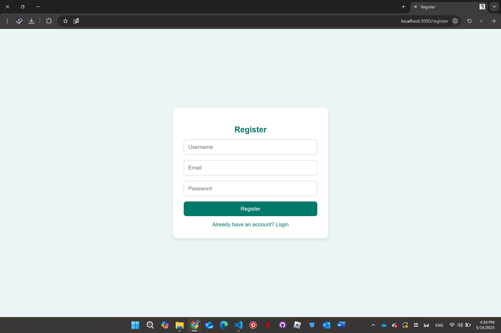
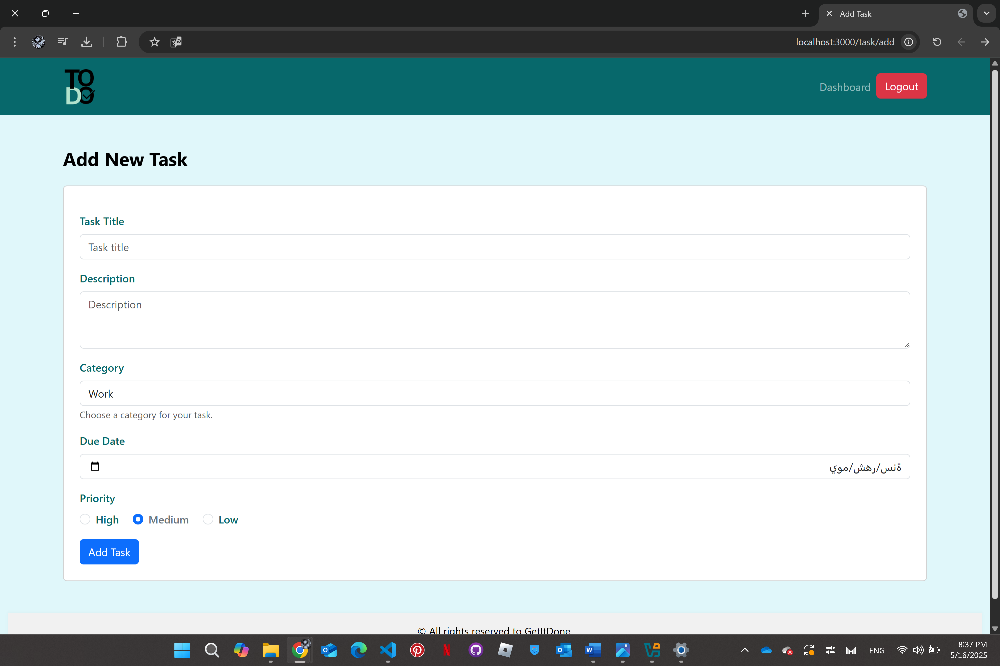

# Get It Done

A powerful task management web application designed to help users efficiently organize their tasks and goals. With a clean interface and intuitive features, users can prioritize their tasks, categorize them, and stay motivated with personalized dashboard messages.

---

## **Goals**
- Provide users with an intuitive platform to efficiently manage and prioritize their daily tasks.
- Allow categorization of tasks by priority and type for better organization.
- Enhance productivity through motivational dashboard messages.

---

## **Key Features**
- Categorize tasks based on priority and type (Work, Personal, School, etc.).
- Set due dates for each task to stay on track.
- Add, edit, and delete tasks easily.
- Motivational messages displayed on the dashboard to encourage productivity.

---

## **Setup Instructions**
1. **Clone the repository:**
    ```bash
    git clone https://github.com/sarah4-k/GetItDone.git
    ```

2. **Navigate to the project directory:**
    ```bash
    cd GetItDone
    ```

3. **Install dependencies:**
    ```bash
    npm install
    ```

4. **Start the server:**
    ```bash
    node server.js
    ```

5. **Open the application in your browser:**
    ```
    http://localhost:3000
    ```

---

## **Technologies Used**
- **Frontend:** EJS, CSS, JavaScript
- **Backend:** Node.js, Express.js
- **Database:** MongoDB
- **Tools:**
  - Visual Studio Code (Text Editor)
  - GitHub (Version Control)

---

## **Screenshots**

### Homepage


### Register Page


### Login Page


### Dashboard


### Add Task


### Edit Task


---

## **Flowchart**


---

## **Future Work**
- Expand to a mobile application.
- Support for shared notes between users.
- Personalized themes where users can pick their own colors and layouts.

---

## **Resources**
- [Node.js](https://nodejs.org/en/): JavaScript runtime built on Chrome's V8 engine, used for server-side logic.
- [MongoDB](https://www.mongodb.com/): NoSQL database for storing user data and tasks.
- [Visual Studio Code](https://code.visualstudio.com/): Powerful code editor for writing and managing code efficiently.

---

## **Team Members**
- Waed Alrefai
- Sarah Alkherayef
- Sarah Babgi
